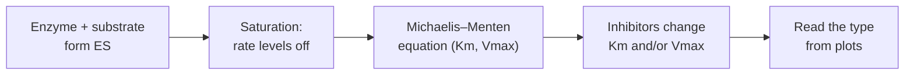

# BIO201 L05: Enzyme Kinetics

<!-- EXAMPLE of the expected quality bar at Deep depth. The biochemistry is real; the source tags point to an imaginary lecture, slide deck and transcript. -->

**Date:** 2026-09-29 · **Professor:** Dr. Rivera · **Unit/Exam:** Midterm 1
**Sources:** Slides `L05-enzymes.pdf` [S#] · Transcript `L05.vtt` [mm:ss] · Reading Lehninger Ch. 6 [R]
**Big question:** How fast does an enzyme-catalyzed reaction go, and how can we measure and change that speed?

**Learning objectives**
- By the end, I can explain what Km and Vmax mean physically, and why Km is not simply "affinity".
- By the end, I can calculate reaction velocity from [S], Km and Vmax, with and without an inhibitor.
- By the end, I can identify an inhibitor's type from how it changes Km, Vmax and a Lineweaver–Burk plot.

**Depth:** Deep

## Core principles
1. **An enzyme's rate is set by how much of it is occupied.** Saturation explains why rate levels off, and two parameters (Km, Vmax) capture the whole curve. *(Course big idea: structure and binding determine function)*
2. **Different binding modes leave different kinetic fingerprints.** *Where* an inhibitor binds determines which parameter changes, so rate data reveal mechanism. *(Course big idea: cells regulate metabolism by controlling enzyme activity)*

## Roadmap

1. **The Michaelis–Menten model** *(core)*: why reaction rate levels off, and the two numbers (Km, Vmax) that describe the curve.
2. **The Lineweaver–Burk plot** *(supporting)*: a straight-line version of the curve that makes Km and Vmax easy to read.
3. **Reversible inhibition** *(core)*: three ways a molecule can slow an enzyme, each leaving a different fingerprint on Km and Vmax.

> **Before you start:** you need (1) what an enzyme's **active site** is (see L04 §2), and (2) the idea of a **reversible binding equilibrium**: molecules bind and unbind constantly, and at equilibrium the rates of binding and unbinding are equal [Added]. If either feels shaky, review L04 §2 first.

---

## 1. Reaction rate levels off because enzymes saturate: the Michaelis–Menten model [S3–S8]

**Why it exists:** Early biochemists measured enzyme reaction rates and found a puzzle. Adding more substrate sped the reaction up at first, then barely at all. A model was needed that explains this levelling off and lets us compare enzymes with just a couple of numbers. [S3][02:10]

**Intuition:** An enzyme can only work on one substrate molecule at a time. When substrate is scarce, most enzymes sit idle, so adding substrate puts more of them to work and the rate climbs. When substrate is plentiful, every enzyme is already busy, so extra substrate just waits its turn and the rate stops rising.
*Analogy:* Cashiers at a store. **Vmax** is the most customers per minute the store can handle when every cashier is busy. **Km** is how many customers need to be waiting to keep *half* the cashiers busy. *Where it breaks:* customers never walk away from a cashier without buying, but a substrate can unbind from an enzyme without reacting (the k₋₁ step below). That's why Km isn't purely about "attraction".

**Definitions**
- `[Def]` **Enzyme–substrate complex (ES)**: the enzyme with substrate bound in its active site, the intermediate that turns into product. [S3]
  $$E + S \underset{k_{-1}}{\overset{k_1}{\rightleftharpoons}} ES \xrightarrow{k_{cat}} E + P$$
- `[Def]` **Vmax**: the maximum initial velocity, reached when the enzyme is fully saturated. $V_{max} = k_{cat}[E]_T$, where $[E]_T$ is total enzyme. *In plain words:* the enzyme population's top speed. [S5]
- `[Def]` **Km (Michaelis constant)**: the substrate concentration at which $v_0 = \tfrac{1}{2}V_{max}$. Mathematically, $K_m = \frac{k_{-1} + k_{cat}}{k_1}$. *In plain words:* how much substrate it takes to keep the enzyme half-busy. [S6][R: p.203]
- **kcat (turnover number)**: the number of substrate molecules one enzyme converts per second when saturated. [S5]

**How it works (the derivation in 4 ideas)** [S7][09:30–13:00]
1. **Steady state**: shortly after mixing, ES forms as fast as it breaks down, so [ES] stays roughly constant: $k_1[E][S] = (k_{-1} + k_{cat})[ES]$.
2. **Conservation**: enzyme is either free or bound, so $[E] = [E]_T - [ES]$.
3. Substituting and solving gives $[ES] = \frac{[E]_T[S]}{K_m + [S]}$. The fraction of enzyme that's busy grows with [S] but can never exceed 1.
4. **Rate = turnover × busy enzymes**: $v_0 = k_{cat}[ES]$, so

$$v_0 = \frac{V_{max}[S]}{K_m + [S]}$$

| Symbol | Meaning | Units |
|---|---|---|
| $v_0$ | initial reaction velocity | µM/s |
| $V_{max}$ | maximum velocity (saturated) | µM/s |
| $[S]$ | substrate concentration | µM or mM |
| $K_m$ | [S] at half Vmax | same as [S] |
| $k_{cat}$ | turnover number | s⁻¹ |

`[Model]` *Use when:* you're measuring initial rates ([P] ≈ 0, so there's no reverse reaction), $[S] \gg [E]_T$, and ES is at steady state. *Doesn't apply to:* allosteric (cooperative) enzymes, which give S-shaped curves (see the non-example below).

> **How do we know?** Leonor Michaelis and Maud Menten (1913) measured *initial* rates of sucrose hydrolysis by invertase at many sucrose concentrations, and showed the rate–[S] curve is a rectangular hyperbola. Their derivation assumed E, S and ES are in rapid equilibrium. Briggs and Haldane (1925) showed the same equation follows from the more general **steady-state** assumption used above. *Limitation:* it describes initial rates of single-substrate, non-cooperative enzymes. Real cellular conditions (product build-up, multiple substrates) can deviate. [R: p.201] [Added: dates]

**Examples**
- *Hexokinase vs glucokinase (the professor's example)*: both phosphorylate glucose. Hexokinase (most tissues) has Km ≈ 0.1 mM, so it's near-saturated at normal blood glucose (about 5 mM). Glucokinase (liver) works at about 10 mM half-saturation, so its rate keeps rising after a meal. **Shows the concept because** the difference in Km, not Vmax, explains why the liver soaks up glucose only when it's abundant. [S6][R: p.203] [Added: values. Glucokinase's curve is slightly sigmoidal, so "10 mM" is strictly its S₀.₅.]
- *Clearing alcohol* [Added]: liver alcohol dehydrogenase has a low Km for ethanol (around 1 mM or less), so after even a drink or two it is close to saturated. The body therefore clears ethanol at a roughly *constant* rate (zero-order elimination), no matter how much more was drunk. **Shows the concept because** at saturation ([S] ≫ Km) the rate is pinned at Vmax (= kcat·[E]_T), so extra substrate just waits its turn.

**Non-example:** *Aspartate transcarbamoylase (ATCase)*: it looks like a Michaelis–Menten enzyme, because its rate also rises with [S] and levels off. But **it isn't one**, because its subunits bind substrate *cooperatively*, giving an S-shaped (sigmoidal) curve rather than a hyperbola. A single Km can't describe it. [S8][R: p.226]

> **Misconception:** "Km *is* the enzyme's affinity for its substrate." This is **only approximately true**. It's tempting because a lower Km does often mean tighter binding. But $K_m = (k_{-1} + k_{cat})/k_1$. It equals the dissociation constant ($K_d = k_{-1}/k_1$) only when $k_{cat} \ll k_{-1}$. If catalysis is fast, Km is larger than Kd, so it *understates* the affinity. Say "Km reflects *apparent* affinity". [S6][10:55]

> **Key idea:** Km is a *concentration* that tells you where the curve bends. Vmax is a *rate* that tells you where it tops out. They answer different questions.

> **Exam signal [11:45]:** "I want you to be able to derive what happens to $v_0$ when [S] equals Km. That's a classic exam question."
> *Derivation:* with $[S] = K_m$, $v_0 = \frac{V_{max}K_m}{K_m + K_m} = \frac{V_{max}}{2}$.

**Worked example: velocity at a given [S]** [S8][14:10]
*Given:* Vmax = 120 µM/s, Km = 3 mM, [S] = 1 mM. *Find:* $v_0$.
1. **Identify the approach.** We have Vmax, Km and [S] and need the initial velocity, and nothing suggests cooperativity, so Michaelis–Menten applies directly.
2. **Set up.** $v_0 = \frac{120 \times 1}{3 + 1}$. Km and [S] are both in mM, so those units cancel and leave µM/s.
3. **Solve.** $v_0 = 120/4 = 30$ µM/s.
4. **Check.** [S] < Km, so $v_0$ must be below ½Vmax (60). 30 < 60 ✓.
**Answer:** 30 µM/s (¼ of Vmax).
**Pattern to remember:** $v_0/V_{max} = [S]/(K_m + [S])$. When [S] = Km you get ½. When [S] = 3·Km you get ¾. When [S] ≫ Km you get close to 1.

**Boundaries:** the model holds for single-substrate, non-cooperative enzymes measured at initial rates. It changes for multi-substrate reactions, allosteric enzymes, and when product builds up.
**Recognition cues:** a rate-vs-[S] curve that is hyperbolic (rises steeply, then flattens with no S-shape), or a problem giving Vmax, Km and [S] and asking for a rate → Michaelis–Menten. An S-shaped curve or the words "cooperative" or "allosteric" → *not* Michaelis–Menten (see L06).

**Check yourself** *(answer aloud before opening)*
1. Why does the velocity curve level off at high [S]?
   

Answer

   Every enzyme active site is occupied (saturation), so adding more substrate can't increase the number of ES complexes. The rate is then limited by $k_{cat}$ and $[E]_T$. [S4][06:20]
   

2. Enzyme A has Km = 0.5 mM and enzyme B has Km = 5 mM for the same substrate. At [S] = 0.5 mM, what fraction of its Vmax does each reach?
   

Answer

   A: 0.5/(0.5 + 0.5) = 50%. B: 0.5/(5 + 0.5) ≈ 9%. Same [S], very different fraction of top speed, because of Km. [S6]
   

3. What happens to Km if you double the enzyme concentration? Why?
   

Answer

   Nothing. Km depends only on rate constants ($k_1$, $k_{-1}$, $k_{cat}$), not on how much enzyme there is. Vmax doubles, because $V_{max} = k_{cat}[E]_T$. (A common trap.) [S5][09:02]
   

4. Apply: a mutation doubles $k_{cat}$ but leaves $k_1$ and $k_{-1}$ unchanged. What happens to Vmax and to Km?
   

Answer

   Vmax doubles ($k_{cat}[E]_T$). Km also *increases*, because $k_{cat}$ is in its numerator. A faster catalyst can make the apparent affinity look *worse*. This is why Km ≠ affinity. [Added]
   

---

## 2. The Lineweaver–Burk plot turns the curve into a straight line [S9–S10]

**Why it exists:** It's hard to read Vmax off a hyperbola that only approaches it. Taking reciprocals of both sides gives a straight line, whose intercepts give Km and Vmax directly. [S9]

$$\frac{1}{v_0} = \frac{K_m}{V_{max}}\cdot\frac{1}{[S]} + \frac{1}{V_{max}}$$

| Feature | Value |
|---|---|
| y-intercept | $1/V_{max}$ |
| x-intercept | $-1/K_m$ |
| slope | $K_m/V_{max}$ |

> **Misconception:** "The x-intercept is −Km." It's **−1/Km**. Set $1/v_0 = 0$ and solve: $1/[S] = -1/K_m$. [S10][19:30]

**Check yourself**
1. A line has y-intercept 0.02 s/µM and x-intercept −0.5 mM⁻¹. What are Vmax and Km?
   

Answer

   Vmax = 1/0.02 = 50 µM/s. Km = 1/0.5 = 2 mM.
   

---

## 3. Inhibitors leave fingerprints: competitive, uncompetitive, mixed [S11–S15]

**Why it exists:** Most drugs and many cellular regulators work by inhibiting enzymes. Knowing *how* an inhibitor acts tells you whether flooding the system with substrate will overcome it, and kinetics lets you work that out from rate data alone. [S11][21:00]

**What you need first:** Km and Vmax (§1), and the Lineweaver–Burk intercepts (§2).

**Intuition:** There are three ways to slow down a cashier.
- **Competitive**: someone stands *at the register* pretending to be a customer. More real customers can crowd them out.
- **Uncompetitive**: someone grabs a cashier *only while they're serving a customer*, freezing the transaction. More customers make it worse, not better, because there are more serving cashiers to grab.
- **Mixed**: someone jams the till from the side, whether or not a customer is there.

*Where the analogy breaks:* inhibitors bind and unbind reversibly and constantly; they don't hold a register for a fixed time.

**Definitions** [S12–S14][R: p.212] (α and α′ are factors ≥ 1 that grow with inhibitor concentration: $\alpha = 1 + [I]/K_I$, $\alpha' = 1 + [I]/K_I'$)
- **Competitive inhibitor**: binds the free enzyme's active site, competing with substrate. Apparent Km = αKm, and Vmax is unchanged.
- **Uncompetitive inhibitor**: binds only the ES complex, at a site other than the active site. Apparent Km = Km/α′ and apparent Vmax = Vmax/α′. Both fall by the same factor.
- **Mixed inhibitor**: binds both E and ES, at a site other than the active site. Apparent Vmax = Vmax/α′, and apparent Km = αKm/α′. If α = α′ (equal binding to E and ES), it's called **pure noncompetitive**: Km is unchanged and Vmax drops.

**How it works: why competitive inhibition leaves Vmax alone**
1. The inhibitor and substrate compete for the *same* site.
2. At very high [S], substrate occupies nearly every active site, so inhibitor molecules rarely get in.
3. Therefore the enzyme still reaches the same top speed (Vmax is unchanged). It just needs more substrate to get halfway there (Km rises).
4. Uncompetitive and mixed inhibitors bind *outside* the active site, so substrate can't push them off. Some enzymes are always disabled, and Vmax falls.

**Examples**
- *Methotrexate* (a cancer drug) is a folate look-alike that competitively inhibits dihydrofolate reductase. **Shows competitive inhibition because** it mimics the substrate and binds the active site. [S12]
- *Ethanol for methanol poisoning* [Added]: ethanol competes with methanol for alcohol dehydrogenase, so less methanol is turned into toxic formaldehyde. **Shows competitive inhibition because** a high enough concentration of one substrate outcompetes the other at the same active site.
- *Lithium and inositol monophosphatase* [Added]: Li⁺ inhibits this enzyme uncompetitively. **Shows uncompetitive inhibition because** it binds only after substrate is bound, so the enzyme is most inhibited when it's busiest.

**Non-example:** *Aspirin acetylating cyclooxygenase (COX)*: it looks like noncompetitive inhibition on a plot, because Vmax drops and Km stays the same. But **it isn't reversible inhibition at all.** Aspirin *covalently* modifies the enzyme, permanently removing active enzyme (lowering $[E]_T$). The critical feature: dilution or dialysis doesn't restore activity. [S15][34:20]

> **Misconception:** "Competitive inhibitors lower Vmax because they slow the enzyme down." This is **wrong**. It's tempting because the reaction *is* slower at any given moderate [S]. But at saturating [S] the substrate outcompetes the inhibitor, so the top speed is unchanged. What changes is how much substrate you need (Km goes up). [S13][24:15]

**Worked example: velocity with a competitive inhibitor** [S14][27:00]
*Given:* the enzyme from §1 (Vmax = 120 µM/s, Km = 3 mM), [S] = 1 mM, competitive inhibitor at [I] = 2 µM with $K_I$ = 1 µM. *Find:* $v_0$.
1. **Identify the approach.** It's competitive, so only Km changes: apparent Km = αKm.
2. **Compute α.** $\alpha = 1 + [I]/K_I = 1 + 2/1 = 3$.
3. **Apparent Km.** $3 \times 3$ mM $= 9$ mM. Vmax stays 120 µM/s.
4. **Solve.** $v_0 = \frac{120 \times 1}{9 + 1} = 12$ µM/s.
5. **Check.** Without the inhibitor it was 30 µM/s (§1), and an inhibitor must lower it: 12 < 30 ✓. As [S] → ∞, $v_0$ → 120 µM/s, matching the unchanged Vmax ✓.
**Answer:** 12 µM/s (down from 30).
**Pattern to remember:** "Competitive: same Vmax, needs more S."

> **How do we know an inhibitor's type?** Measure $v_0$ over a range of [S] at several fixed [I], then fit the Michaelis–Menten equation, or draw Lineweaver–Burk lines, for each [I]. The *pattern* across [I] (lines meeting on the y-axis, parallel lines, or lines meeting to the left) identifies the mechanism. Testing whether activity returns after dialysis separates reversible from irreversible inhibitors. *Limitation:* Lineweaver–Burk plots exaggerate errors at low [S], so modern labs fit the curve directly by nonlinear regression. [S14][29:10]

**Boundaries:** these patterns assume reversible binding, a single inhibitor and Michaelis–Menten kinetics. Irreversible inhibitors and allosteric enzymes behave differently.
**Recognition cues:** "Vmax unchanged, Km up" or "overcome by excess substrate" → competitive. "Both Km and Vmax fall by the same factor" or "parallel Lineweaver–Burk lines" → uncompetitive. "Vmax down, can't be overcome" → mixed or noncompetitive. "Activity doesn't return after dialysis" → irreversible.

**Check yourself** *(answer aloud before opening)*
1. Why can adding lots of substrate overcome a competitive inhibitor but not an uncompetitive one?
   

Answer

   A competitive inhibitor competes for the same site, so substrate can displace it. An uncompetitive inhibitor binds *only* the ES complex, so more substrate makes more ES for it to bind. The inhibition can't be outcompeted, and Vmax falls. [S13]
   

2. Classify: an inhibitor lowers Vmax by half and leaves Km unchanged, and activity returns fully after dialysis. What type is it?
   

Answer

   Pure noncompetitive (mixed with α = α′). It's reversible, because activity returned after dialysis, so it isn't covalent like aspirin. [S14][S15]
   

3. In the worked example, what [S] would be needed to get back to 30 µM/s with the inhibitor present?
   

Answer

   Solve $30 = 120[S]/(9 + [S])$: $30(9 + [S]) = 120[S]$, so $270 = 90[S]$ and $[S] = 3$ mM (three times the uninhibited 1 mM, matching α = 3).
   

## Comparison matrix: types of reversible inhibition [S15]
| | Competitive | Uncompetitive | Mixed (pure noncompetitive if α = α′) |
|---|---|---|---|
| Binds to | Free E (active site) | ES complex only | E and ES (another site) |
| Apparent Km | ↑ (×α) | ↓ (÷α′) | ×α/α′: ↑, ↓ or = (pure: =) |
| Apparent Vmax | = | ↓ (÷α′) | ↓ (÷α′) |
| Overcome by more [S]? | Yes | No | No |
| Lineweaver–Burk | Lines meet on the y-axis | Parallel lines | Lines meet left of the y-axis (on the x-axis if pure) |
| **Tell-apart cue** | "Same top speed, needs more S" | "Parallel lines" | "Top speed drops" |

## Connections
- Builds on: L04 §2–3, active sites and transition-state stabilization (why enzymes speed reactions up at all).
- Leads to: L06, allosteric regulation (sigmoidal kinetics, like ATCase in §1, *don't* follow Michaelis–Menten).
- Big theme: regulation of metabolism. Inhibitors are how cells and drugs control pathway flux.

## Common mistakes and confusions
- **"Low Km = fast enzyme."** No. Km is about how much substrate is needed. Speed at saturation is Vmax or kcat. (Student question at [27:40].)
- **"Km = affinity."** Only when $k_{cat} \ll k_{-1}$ (§1).
- **x-intercept = −Km.** It's −1/Km (§2).
- **Calling aspirin a noncompetitive inhibitor.** It's irreversible (covalent). It only *looks* noncompetitive on a plot (§3).

## Summary
Enzyme-catalyzed reactions speed up with substrate concentration until the enzyme becomes saturated, at which point the velocity plateaus at Vmax. The Michaelis–Menten equation, derived by assuming the enzyme–substrate complex is at steady state, describes this hyperbola with two parameters. Vmax equals kcat times the total enzyme, so it scales with the amount of enzyme. Km, the substrate concentration giving half-maximal velocity, depends only on rate constants, which is why it characterizes the enzyme–substrate pair and reflects, but doesn't equal, its affinity. Taking reciprocals gives the Lineweaver–Burk line, whose intercepts reveal 1/Vmax and −1/Km. Reversible inhibitors change these parameters in diagnostic ways: competitive inhibitors raise the apparent Km but can be outcompeted by substrate, while uncompetitive and mixed inhibitors lower Vmax because substrate can't displace them. These fingerprints let biochemists identify how a drug or regulator acts from rate data alone.

## Explain it back (no answers on purpose)
1. Explain Km to a friend who has never taken biochemistry, without using the words "affinity" or "Michaelis".
2. Why does a faster catalytic step ($k_{cat}$) *raise* Km? What does that tell you about using Km as a measure of binding?
3. Sketch Lineweaver–Burk plots for all three inhibitor types from memory, and explain why each set of lines crosses (or doesn't) where it does.

## Professor's-eye view
| Likely exam question | A full-credit answer must include | A typical B-level answer misses |
|---|---|---|
| Show that $v_0 = ½V_{max}$ when [S] = Km. | Substitution into the Michaelis–Menten equation with the algebra shown, and the meaning: Km marks half-saturation | States the result without the algebra, or calls Km a "rate" |
| Why can't Km be read directly as affinity? | $K_m = (k_{-1}+k_{cat})/k_1$; equals $K_d$ only when $k_{cat} \ll k_{-1}$; a fast $k_{cat}$ inflates Km | Says "low Km = high affinity" with no conditions |
| Given Lineweaver–Burk plots ± inhibitor, identify the type and explain the mechanism. | Correct type from the intercept pattern, *and* the binding-site reason (why substrate can or can't outcompete) | Names the type correctly but gives no mechanism, or mixes up the intercepts |
| Calculate $v_0$ with a competitive inhibitor present. | α = 1 + [I]/K_I; apparent Km = αKm; Vmax unchanged; units carried | Lowers Vmax instead of raising Km |
| Distinguish noncompetitive from irreversible inhibition experimentally. | Dialysis or dilution restores activity only for reversible inhibitors; the plots alone can look identical | Relies only on the plot |

**Memorize vs understand:** memorize the definitions of Km, Vmax and kcat, and the Lineweaver–Burk intercepts. Understand and be able to apply the derivation logic, the binding-site reasoning for each inhibitor type, and the calculations.

## Gaps and [VERIFY]
- [ ] [VERIFY] Slide 10 labels the x-intercept as "−Km", but the transcript [19:30] says "−1/Km". The textbook (p.206) and the algebra in §2 give −1/Km. Ask the professor whether the slide has a typo.

## What your notes missed
| Missed or incorrect point | Why it matters | Source |
|---|---|---|
| Km does **not** change with enzyme concentration (your notes say "Km ↑ with more enzyme") | Classic trap, and the professor warned about it | [S5][09:02] |
| *Why* competitive inhibition can be overcome by high [S] | Relationship question: "compare inhibitor types" is likely on the exam | [S13][24:15] |
| The "[S] = Km gives ½Vmax" derivation | Explicit exam signal | [11:45] |

**Revision task:** add each point to *your own* notes in your own words, and link it to something already there. Revise, don't recopy.

---
*Professor review:* Accuracy 5 · Precision 5 · Completeness 5 · Depth 5 · Organization 5 · Conditionalized 5 · Clarity 5 · Synthesis 4 · Exam alignment 5 · Source fidelity 5. *(Synthesis 4: the lecture didn't connect to the readings on metabolic control. Revisit after L06.)*

**Next steps (Cornell cycle)**
- [ ] **Today, recite:** cover each section, answer "Check yourself" aloud, then do "Explain it back".
- [ ] **09/30, quiz:** `quizzes/Q-L05.md`, closed-book, confidence first.
- [ ] **Weekly, review:** 10 min reciting cue questions across L01–L05. Next full review: 10/06.
- [ ] 14 new flashcards added to the deck.
