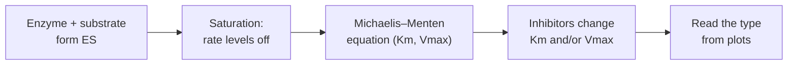

# BIO201 L05: Enzyme Kinetics

<!-- EXAMPLE of the expected quality bar: Deep depth, source-locked, with side notes.
     The biochemistry is real; the source tags point to an imaginary lecture (16 slides, 40-minute transcript).
     Every main-content line cites a slide [S#], a timestamp [mm:ss] or an earlier note. Outside analogies and
     examples appear only in 💡 side notes. Check with:
     python3 scripts/check_sources.py examples/example-lecture-note.md --slides 16 --skip-slides 1,2 --duration 40:00 -->

**Date:** 2026-09-29 · **Professor:** Dr. Rivera · **Unit/Exam:** Midterm 1
**Sources:** Slides `L05-enzymes.pdf` [S#] · Transcript `L05.vtt` [mm:ss] · Reading Lehninger Ch. 6, provided by the student [R]
**Big question:** How fast does an enzyme-catalyzed reaction go, and how can we measure and change that speed? [S2]

**Learning objectives** (from slide 2)
- Explain what Km and Vmax mean physically, and why Km is not simply "affinity".
- Calculate reaction velocity from [S], Km and Vmax, with and without an inhibitor.
- Identify an inhibitor's type from how it changes Km, Vmax and a Lineweaver–Burk plot.

**Depth:** Deep

## Core principles
1. **An enzyme's rate is set by how much of it is occupied.** Saturation explains why rate levels off, and two parameters (Km, Vmax) describe the whole curve. [S3][S4][02:10] *(Course big idea 2: binding determines function [S1])*
2. **Different binding modes leave different kinetic fingerprints.** *Where* an inhibitor binds determines which parameter changes, so rate data reveal mechanism. [S11][21:00] *(Course big idea 3: cells regulate metabolism by controlling enzymes [S1])*

## Roadmap

1. **The Michaelis–Menten model** *(core)*: why reaction rate levels off, and the two numbers (Km, Vmax) that describe the curve. [S3–S8]
2. **The Lineweaver–Burk plot** *(supporting)*: a straight-line version of the curve that makes Km and Vmax easy to read. [S9–S10]
3. **Reversible inhibition** *(core)*: three binding modes, each leaving a different fingerprint on Km and Vmax. [S11–S15]

> **Before you start:** the professor recapped two ideas from last lecture that you need here: an enzyme's **active site** (see L04 §2), and that binding is **reversible**, with molecules binding and unbinding constantly. [01:30–02:05]

---

## 1. Reaction rate levels off because enzymes saturate: the Michaelis–Menten model [S3–S8]

**Why it exists:** Early measurements showed a puzzle. Adding substrate sped the reaction up at first, then barely at all. A model was needed to explain the levelling off and to compare enzymes with a couple of numbers. [S3][02:10]

**Intuition (the professor's explanation):** An enzyme works on one substrate molecule at a time. When substrate is scarce, most enzymes sit idle, so adding substrate puts more of them to work. When substrate is plentiful, every enzyme is already busy, so extra substrate just waits its turn and the rate stops rising. [05:10–06:20]

> 💡 **Side note (not from your lecture): analogy.** Picture cashiers in a store. **Vmax** is the most customers per minute the store can serve when every cashier is busy. **Km** is how many customers must be waiting to keep *half* the cashiers busy. *Where the analogy breaks:* customers never walk away from a cashier without buying, but a substrate can unbind without reacting (the k₋₁ step). That's why Km isn't purely "attraction". *Illustrates:* Vmax and Km (§1, [S5–S6]).

**Definitions** [S3][S5][S6]
- `[Def]` **Enzyme–substrate complex (ES)**: the enzyme with substrate bound in its active site, the intermediate that turns into product.
  $$E + S \underset{k_{-1}}{\overset{k_1}{\rightleftharpoons}} ES \xrightarrow{k_{cat}} E + P$$
- `[Def]` **Vmax**: the maximum initial velocity, reached when the enzyme is fully saturated; $V_{max} = k_{cat}[E]_T$, where $[E]_T$ is total enzyme.
- `[Def]` **Km (Michaelis constant)**: the substrate concentration at which $v_0 = \tfrac{1}{2}V_{max}$. Mathematically, $K_m = \frac{k_{-1} + k_{cat}}{k_1}$.
- `[Def]` **kcat (turnover number)**: substrate molecules converted per enzyme per second at saturation.

**How it works: the derivation in 4 ideas** [S7][09:30–13:00]
1. **Steady state**: shortly after mixing, ES forms as fast as it breaks down, so [ES] stays roughly constant: $k_1[E][S] = (k_{-1} + k_{cat})[ES]$.
2. **Conservation**: enzyme is either free or bound, so $[E] = [E]_T - [ES]$.
3. Substituting and solving gives $[ES] = \frac{[E]_T[S]}{K_m + [S]}$. The fraction of enzyme that is busy grows with [S] but can never exceed 1.
4. **Rate = turnover × busy enzymes**: $v_0 = k_{cat}[ES]$, so

$$v_0 = \frac{V_{max}[S]}{K_m + [S]}$$

| Symbol | Meaning | Units |
|---|---|---|
| $v_0$ | initial reaction velocity | µM/s |
| $V_{max}$ | maximum velocity (saturated) | µM/s |
| $[S]$ | substrate concentration | µM or mM |
| $K_m$ | [S] at half Vmax | same as [S] |
| $k_{cat}$ | turnover number | s⁻¹ |

`[Model]` *Use when:* you're measuring initial rates ([P] ≈ 0), $[S] \gg [E]_T$, and ES is at steady state. *Doesn't apply to:* allosteric (cooperative) enzymes, which give S-shaped curves. [S7][13:20]

> **How do we know?** Michaelis and Menten (1913) measured initial rates of sucrose hydrolysis by invertase at many sucrose concentrations and found a hyperbola. Briggs and Haldane (1925) later derived the same equation from the steady-state assumption used above. *Limitation:* it describes initial rates of single-substrate, non-cooperative enzymes. [S7][08:15–09:30]

**Examples**
- *Hexokinase vs glucokinase*: both phosphorylate glucose. Hexokinase has Km ≈ 0.1 mM, so it is near-saturated at normal blood glucose (about 5 mM). Glucokinase (liver) is half-saturated around 10 mM, so its rate keeps rising after a meal. **Shows the concept because** a difference in Km, not Vmax, explains why the liver takes up glucose mainly when it's abundant. [S6][R: Lehninger p.203]

> 💡 **Side note (not from your lecture): real-world example.** Liver alcohol dehydrogenase has a low Km for ethanol, so it is close to saturated after even a drink or two. That's why the body clears alcohol at a roughly *constant* rate however much was drunk: at saturation the rate is pinned at Vmax. *Illustrates:* saturation, [S] ≫ Km → v₀ ≈ Vmax (§1, [S4]).

**Non-example:** *Aspartate transcarbamoylase (ATCase)*: its rate also rises with [S] and levels off, so it looks like a Michaelis–Menten enzyme. But **it isn't one**: its subunits bind substrate cooperatively, giving an S-shaped curve that a single Km can't describe. [S8][13:40]

> **Misconception (raised in lecture):** "Km *is* the enzyme's affinity for its substrate." This is **only approximately true**. Since $K_m = (k_{-1} + k_{cat})/k_1$, it equals the dissociation constant $K_d = k_{-1}/k_1$ only when $k_{cat} \ll k_{-1}$. If catalysis is fast, Km is larger than Kd and understates the affinity. Say "Km reflects *apparent* affinity". [S6][10:55]

> **Key idea:** Km is a *concentration* that tells you where the curve bends. Vmax is a *rate* that tells you where it tops out. [S6][11:10]

> **Exam signal [11:45]:** "I want you to be able to derive what happens to $v_0$ when [S] equals Km. That's a classic exam question."
> *Derivation:* with $[S] = K_m$, $v_0 = \frac{V_{max}K_m}{K_m + K_m} = \frac{V_{max}}{2}$. [11:45–12:30]

**Worked example (from lecture): velocity at a given [S]** [S8][14:10]
*Given:* Vmax = 120 µM/s, Km = 3 mM, [S] = 1 mM. *Find:* $v_0$.
1. **Approach.** We have Vmax, Km and [S] and need the initial velocity, so apply Michaelis–Menten directly.
2. **Set up.** $v_0 = \frac{120 \times 1}{3 + 1}$. Km and [S] are both in mM, so those units cancel.
3. **Solve.** $v_0 = 120/4 = 30$ µM/s.
4. **Check.** [S] < Km, so $v_0$ must be below ½Vmax (60). 30 < 60 ✓.
**Answer:** 30 µM/s (¼ of Vmax). The professor's pattern: [S] = Km gives ½Vmax, [S] = 3·Km gives ¾Vmax, and [S] ≫ Km gives close to Vmax. [14:10–15:30]

**Boundaries:** single-substrate, non-cooperative enzymes measured at initial rates. The model changes for multi-substrate reactions, allosteric enzymes, and when product builds up. [S7][13:20]
**Recognition cues:** a hyperbolic rate-vs-[S] curve, or a problem giving Vmax, Km and [S] → Michaelis–Menten. An S-shaped curve or "cooperative" → not Michaelis–Menten. [S8][13:40–14:05]

**Check yourself** *(answer aloud before opening)*
1. Why does the velocity curve level off at high [S]?
   

Answer

   Every active site is occupied (saturation), so more substrate can't increase the number of ES complexes. The rate is limited by $k_{cat}$ and $[E]_T$. [S4][06:20]
   

2. Enzyme A has Km = 0.5 mM and enzyme B has Km = 5 mM. At [S] = 0.5 mM, what fraction of its Vmax does each reach?
   

Answer

   A: 0.5/(0.5 + 0.5) = 50%. B: 0.5/(5 + 0.5) ≈ 9%. [S6]
   

3. What happens to Km if you double the enzyme concentration? Why?
   

Answer

   Nothing. Km depends only on rate constants; Vmax doubles, because $V_{max} = k_{cat}[E]_T$. [S5][09:02]
   

4. Apply: a mutation doubles $k_{cat}$ but leaves $k_1$ and $k_{-1}$ unchanged. What happens to Vmax and Km?
   

Answer

   Vmax doubles ($k_{cat}[E]_T$). Km increases, because $k_{cat}$ is in its numerator. [S5][S6]
   

---

## 2. The Lineweaver–Burk plot turns the curve into a straight line [S9–S10]

**Why it exists:** Vmax is hard to read off a hyperbola that only approaches it. Taking reciprocals gives a straight line whose intercepts give Km and Vmax. [S9][17:40]

$$\frac{1}{v_0} = \frac{K_m}{V_{max}}\cdot\frac{1}{[S]} + \frac{1}{V_{max}}$$

| Feature | Value |
|---|---|
| y-intercept | $1/V_{max}$ |
| x-intercept | $-1/K_m$ |
| slope | $K_m/V_{max}$ |

> **Misconception (slide typo flagged in lecture):** "The x-intercept is −Km." It's **−1/Km**: set $1/v_0 = 0$ and solve, giving $1/[S] = -1/K_m$. [S10][19:30]

**Check yourself**
1. A line has y-intercept 0.02 s/µM and x-intercept −0.5 mM⁻¹. What are Vmax and Km?
   

Answer

   Vmax = 1/0.02 = 50 µM/s. Km = 1/0.5 = 2 mM. [S9]
   

---

## 3. Inhibitors leave fingerprints: competitive, uncompetitive, mixed [S11–S15]

**Why it exists:** Most drugs and many cellular regulators work by inhibiting enzymes. Knowing *how* an inhibitor acts tells you whether flooding the system with substrate will overcome it, and kinetics reveals that from rate data alone. [S11][21:00]

**What you need first:** Km and Vmax (§1), and the Lineweaver–Burk intercepts (§2).

**Intuition (the professor's explanation):** What matters is *where* the inhibitor binds. If it sits in the active site, substrate can push it out. If it binds somewhere else, substrate can't, and some enzymes stay disabled however much substrate you add. [21:40–22:30]

> 💡 **Side note (not from your lecture): analogy.** Three ways to slow down a cashier. *Competitive:* someone stands at the register pretending to be a customer, and more real customers can crowd them out. *Uncompetitive:* someone grabs a cashier only while they're serving, so more customers mean more cashiers to grab. *Mixed:* someone jams the till from the side, customer or not. *Where it breaks:* inhibitors bind and unbind constantly; they don't hold a register for a fixed time. *Illustrates:* the three binding modes (§3, [S12–S14]).

**Definitions** [S12–S14] (α and α′ are factors ≥ 1 that grow with inhibitor concentration: $\alpha = 1 + [I]/K_I$, $\alpha' = 1 + [I]/K_I'$)
- `[Def]` **Competitive inhibitor**: binds the free enzyme's active site, competing with substrate. Apparent Km = αKm, and Vmax is unchanged.
- `[Def]` **Uncompetitive inhibitor**: binds only the ES complex, at a site other than the active site. Apparent Km = Km/α′ and apparent Vmax = Vmax/α′.
- `[Def]` **Mixed inhibitor**: binds E and ES at another site. Apparent Vmax = Vmax/α′, apparent Km = αKm/α′. If α = α′ it's **pure noncompetitive**: Km is unchanged and Vmax drops.

**How it works: why competitive inhibition leaves Vmax alone** [S13][24:15–26:00]
1. Inhibitor and substrate compete for the *same* site.
2. At very high [S], substrate occupies nearly every active site, so inhibitor molecules rarely get in.
3. So the enzyme still reaches the same top speed (Vmax is unchanged). It just needs more substrate to get halfway (Km rises).
4. Uncompetitive and mixed inhibitors bind outside the active site, so substrate can't displace them, and Vmax falls.

**Examples**
- *Methotrexate*, a cancer drug, is a folate look-alike that competitively inhibits dihydrofolate reductase. **Shows competitive inhibition because** it mimics the substrate and binds the active site. [S12][23:05]

> 💡 **Side note (not from your lecture): real-world example.** Ethanol is used to treat methanol poisoning. It competes with methanol for alcohol dehydrogenase, so less methanol is converted to toxic formaldehyde. *Illustrates:* competitive inhibition, where a high concentration of a competing substrate outcompetes another at the same active site (§3, [S12]).

**Non-example:** *Aspirin acetylating cyclooxygenase (COX)*: it looks like noncompetitive inhibition on a plot, because Vmax drops and Km stays the same. But **it isn't reversible inhibition**: aspirin covalently modifies the enzyme, permanently removing active enzyme. The critical feature: dilution or dialysis doesn't restore activity. [S15][34:20]

> **Misconception (raised in lecture):** "Competitive inhibitors lower Vmax because they slow the enzyme down." This is **wrong**. At saturating [S] the substrate outcompetes the inhibitor, so the top speed is unchanged. What changes is how much substrate you need (Km goes up). [S13][24:15]

> **How do we know an inhibitor's type?** Measure $v_0$ across [S] at several fixed [I], then plot or fit each set. The pattern of lines across [I] identifies the mechanism, and testing whether activity returns after dialysis separates reversible from irreversible inhibitors. *Limitation noted in lecture:* Lineweaver–Burk plots exaggerate errors at low [S], so labs fit the curve directly. [S14][29:10–30:40]

**Worked example (from lecture): velocity with a competitive inhibitor** [S14][27:00]
*Given:* Vmax = 120 µM/s, Km = 3 mM, [S] = 1 mM, competitive inhibitor at [I] = 2 µM with $K_I$ = 1 µM. *Find:* $v_0$.
1. **Approach.** It's competitive, so only Km changes: apparent Km = αKm.
2. **Compute α.** $\alpha = 1 + 2/1 = 3$.
3. **Apparent Km.** $3 \times 3$ mM $= 9$ mM. Vmax stays 120 µM/s.
4. **Solve.** $v_0 = \frac{120 \times 1}{9 + 1} = 12$ µM/s.
5. **Check.** Without the inhibitor it was 30 µM/s (§1), and an inhibitor must lower it: 12 < 30 ✓.
**Answer:** 12 µM/s (down from 30). [27:00–28:45]

**Boundaries:** reversible binding, a single inhibitor, Michaelis–Menten kinetics. Irreversible inhibitors and allosteric enzymes behave differently. [S15][33:50]
**Recognition cues:** "Vmax unchanged, Km up" or "overcome by excess substrate" → competitive. "Km and Vmax both fall by the same factor" or "parallel lines" → uncompetitive. "Vmax down, can't be overcome" → mixed or noncompetitive. "Activity doesn't return after dialysis" → irreversible. [S14][S15][31:00–32:30]

**Check yourself** *(answer aloud before opening)*
1. Why can lots of substrate overcome a competitive inhibitor but not an uncompetitive one?
   

Answer

   A competitive inhibitor competes for the same site, so substrate can displace it. An uncompetitive inhibitor binds only ES, so more substrate makes more ES for it to bind; Vmax falls. [S13][24:15–26:00]
   

2. Classify: an inhibitor halves Vmax, leaves Km unchanged, and activity returns fully after dialysis. What type?
   

Answer

   Pure noncompetitive (mixed with α = α′). It's reversible, because dialysis restored activity, so it isn't covalent like aspirin. [S14][S15]
   

3. In the worked example, what [S] would get you back to 30 µM/s with the inhibitor present?
   

Answer

   $30 = 120[S]/(9 + [S])$ gives $270 = 90[S]$, so $[S] = 3$ mM, three times the uninhibited 1 mM (matching α = 3). [S14]
   

## Comparison matrix: types of reversible inhibition [S15]
| | Competitive | Uncompetitive | Mixed (pure noncompetitive if α = α′) |
|---|---|---|---|
| Binds to | Free E (active site) | ES complex only | E and ES (another site) |
| Apparent Km | ↑ (×α) | ↓ (÷α′) | ×α/α′ (pure: =) |
| Apparent Vmax | = | ↓ (÷α′) | ↓ (÷α′) |
| Overcome by more [S]? | Yes | No | No |
| Lineweaver–Burk | Lines meet on y-axis | Parallel lines | Lines meet left of y-axis (on x-axis if pure) |
| **Tell-apart cue** | "Same top speed, needs more S" | "Parallel lines" | "Top speed drops" |

## Connections
- Builds on: active sites and transition-state stabilization (L04 §2–3), recapped at the start of lecture. [01:30]
- Leads to: allosteric regulation next lecture. Sigmoidal kinetics, like ATCase in §1, don't follow Michaelis–Menten. [S16][38:40]
- Big theme: inhibitors are how cells and drugs control pathway flux (course big idea 3). [S1][S11]

## Common mistakes and confusions
- **"Low Km = fast enzyme."** No. Km is about how much substrate is needed; speed at saturation is Vmax or kcat. (Student question at [27:40].)
- **"Km = affinity."** Only when $k_{cat} \ll k_{-1}$. [10:55]
- **x-intercept = −Km.** It's −1/Km. [S10][19:30]
- **Calling aspirin a noncompetitive inhibitor.** It's irreversible. It only *looks* noncompetitive on a plot. [S15][34:20]

## Summary
Enzyme-catalyzed reactions speed up with substrate concentration until the enzyme saturates, at which point the velocity plateaus at Vmax (§1). The Michaelis–Menten equation, derived from the steady-state assumption, describes this hyperbola with two parameters: Vmax, which equals kcat times total enzyme, and Km, the substrate concentration giving half-maximal velocity, which depends only on rate constants and reflects, but doesn't equal, affinity (§1). Taking reciprocals gives the Lineweaver–Burk line, whose intercepts reveal 1/Vmax and −1/Km (§2). Reversible inhibitors change these parameters in diagnostic ways: competitive inhibitors raise the apparent Km but can be outcompeted, while uncompetitive and mixed inhibitors lower Vmax because substrate can't displace them (§3).

## Professor's-eye view
| Likely exam question | A full-credit answer must include |
|---|---|
| Show that $v_0 = ½V_{max}$ when [S] = Km. (explicit exam signal) | Substitution into the Michaelis–Menten equation with the algebra shown, and the meaning: Km marks half-saturation. [11:45–12:30] |
| Why can't Km be read directly as affinity? | $K_m = (k_{-1}+k_{cat})/k_1$; equals $K_d$ only when $k_{cat} \ll k_{-1}$. [S6][10:55] |
| Identify an inhibitor's type from Lineweaver–Burk plots and explain the mechanism. | The type from the intercept pattern, *and* the binding-site reason. [S13][S14] |
| Calculate $v_0$ with a competitive inhibitor present. | α = 1 + [I]/K_I; apparent Km = αKm; Vmax unchanged; units carried. [S14][27:00] |
| Distinguish noncompetitive from irreversible inhibition. | Dialysis or dilution restores activity only for reversible inhibitors; the plots alone can look identical. [S15][34:20] |

**Memorize vs understand:** memorize the definitions of Km, Vmax and kcat, and the Lineweaver–Burk intercepts. Understand and be able to apply the derivation logic, the binding-site reasoning, and the calculations.

## Explain it back (no answers on purpose)
1. Explain Km to a friend who has never taken biochemistry, without using the words "affinity" or "Michaelis".
2. Why does a faster catalytic step ($k_{cat}$) *raise* Km? What does that tell you about using Km as a measure of binding?
3. Sketch Lineweaver–Burk plots for all three inhibitor types from memory, and explain why each set of lines crosses (or doesn't) where it does.

## Not covered in this lecture
*Your slides and transcript don't provide these. Where a side note fills the gap it says so, but side notes are illustrations, not course content.*
- **Km and Vmax**: the lecture gave no analogy. See the side note in §1.
- **Uncompetitive and mixed inhibition**: no example of either was given. Only the side-note analogy in §3 illustrates them. Ask in office hours or check Lehninger Ch. 6.
- **Lineweaver–Burk**: the lecture didn't explain *why* the plot exaggerates errors at low [S]. [30:40]

## Gaps and [VERIFY]
- [ ] [VERIFY] Slide 10 labels the x-intercept as "−Km", but the transcript [19:30] and the provided reading (Lehninger p.206) give −1/Km. Ask whether the slide has a typo.

## What your notes missed
| Missed or incorrect point | Why it matters | Source |
|---|---|---|
| Km does **not** change with enzyme concentration (your notes say "Km ↑ with more enzyme") | Classic trap, and the professor warned about it | [S5][09:02] |
| *Why* competitive inhibition can be overcome by high [S] | Relationship question likely on the exam | [S13][24:15] |
| The "[S] = Km gives ½Vmax" derivation | Explicit exam signal | [11:45] |

**Revision task:** add each point to *your own* notes in your own words, and link it to something already there. Revise, don't recopy.

---
*Professor review:* Accuracy 5 · Precision 5 · Completeness 5 · Depth 4 · Organization 5 · Conditionalized 5 · Clarity 5 · Synthesis 4 · Exam alignment 5 · **Source fidelity 5** *(Depth 4: the lecture gave no examples of uncompetitive or mixed inhibition, so those rely on a side-note analogy. Synthesis 4: no link to the readings on metabolic control.)*

**Next steps (Cornell cycle)**
- [ ] **Today, recite:** cover each section, answer "Check yourself" aloud, then do "Explain it back".
- [ ] **09/30, quiz:** `quizzes/Q-L05.md`, closed-book, confidence first.
- [ ] **Weekly, review:** 10 min reciting cue questions across L01–L05. Next full review: 10/06.
- [ ] 14 new flashcards added to the deck. None rely on side notes.
