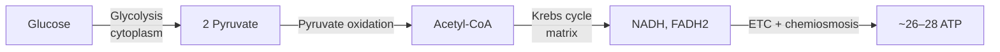

# Note Formats and Conventions

## Master lecture note (Cornell hybrid)

The paper Cornell layout (cue column | notes | summary) is translated into Markdown like this:

| Paper Cornell | Markdown equivalent |
|---|---|
| Right column: notes | The section body: hierarchical bullets, callouts, tables, diagrams |
| Left column: cues and questions | **Check yourself** blocks after each section, with answers hidden in `<details>` |
| Bottom: summary | The **Summary** paragraph at the end of the note |
| "Recite" step | The student answers the cue questions *before* opening `<details>` |
| "Reflect" step | **Connections** and **Explain it back** sections |

See `templates/lecture-note.md` for the full skeleton.

## Writing style for notes

- **Own-words synthesis, not transcription.** Rephrase the slide text into clear, complete statements. Keep official terminology exactly, because exams use it.
- **Hierarchy.** Use headings (`##` per section, `###` per sub-topic) and nested bullets (at most 3 levels). A reader skimming only the headings and bold terms should get the skeleton of the lecture.
- **Bold is rare and meaningful.** Use it only for key terms at their defining occurrence and for exam-critical facts. If everything is bold, nothing is.
- **Complete sentences for ideas, fragments for facts.** "Enzymes lower activation energy by stabilizing the transition state" (idea) versus "Km: substrate conc. at ½ Vmax" (fact).
- **One idea per bullet.**
- **Every definition has the form** `**Term**: precise definition. *In plain words:* … *Example:* …`
- **Source tags** at the end of the bullet or paragraph: `[S7]`, `[S7–9]`, `[14:32]`, `[R: Campbell Ch8 p.152]`, `[Added]`, `[VERIFY]`.

## Callouts

Use blockquotes with a bold label. They render everywhere (GitHub, VS Code, Obsidian, Notion import).

```markdown
> **Key idea:** The most important claim in this section.

> **Exam signal [23:10]:** Professor: "You will definitely need to know how to derive this."

> **Common mistake:** Confusing X with Y. X is about …, Y is about …

> **Intuition:** A plain-language analogy or mental model.

> **[VERIFY]:** Slide 12 says 37 kJ/mol but the transcript says 30.5 kJ/mol. Check the textbook.
```

## Check-yourself blocks (the cue column)

```markdown
**Check yourself**
1. Why does competitive inhibition increase apparent Km but not change Vmax?
   <details><summary>Answer</summary>

   The inhibitor competes for the active site, so more substrate is needed to reach half-max. At very high [S] the substrate outcompetes the inhibitor, so Vmax is still reachable. [S14][31:05]
   </details>
2. …
```

Rules: 2–4 questions per section. At least one per section must be **why, how or apply**, not just "what is". Leave a blank line after `<summary>` so Markdown renders inside the block.

## Matrix notes (comparison tables)

Use a table whenever three or more items share attributes (Kiewra). Rows are the items, columns are the attributes. Always add a "How to tell them apart" row or column.

```markdown
| | Mitosis | Meiosis |
|---|---|---|
| Purpose | Growth, repair | Gamete production |
| Divisions | 1 | 2 |
| Daughter cells | 2, diploid, identical | 4, haploid, unique |
| Crossing over | No | Yes (prophase I) |
| **Tell-apart cue** | "Copy" | "Mix and halve" |
```

## Diagrams (dual coding)

Prefer **Mermaid** (renders on GitHub, Obsidian and many editors). Use ASCII only when Mermaid can't express it.



Useful Mermaid types: `flowchart` (processes, causal chains, decision trees), `sequenceDiagram` (protocols, signalling), `timeline` (history), `mindmap` (topic overviews), `classDiagram` (taxonomies, OOP), `stateDiagram-v2` (state machines, cycles). Keep node labels short, and wrap labels containing special characters in quotes.

For every slide diagram you recreate, add one sentence on **what it shows** and one on **why it matters**.

## Math and formulas

- Inline `$E = mc^2$`, display `$$\Delta G = \Delta H - T\Delta S$$`.
- For every formula, give a **variable table** (symbol, meaning, units), **when to use it and its assumptions**, and a **worked example**.
- Worked example format:

```markdown
**Worked example: <problem in one line>** [S22][41:10]
*Given:* … *Find:* …
1. **Identify the approach.** Because …, use … (the *why* of choosing this method).
2. **Set up.** $…$
3. **Solve.** $…$ (algebra shown; units carried)
4. **Check.** Sign, units, order of magnitude, limiting case.
**Answer:** …
**Pattern to remember:** When you see <cue>, do <method>.
```

## Subject-specific add-ons

These are covered in more depth in `subject-playbooks.md`.
- **Process-heavy (bio, chem, CS algorithms)**: a numbered step table (Step | What happens | Where | Inputs to Outputs | Why), plus a flowchart.
- **Argument-heavy (philosophy, history, social sciences, law)**: claim, evidence, reasoning, counterargument, significance. Include a timeline or a "who argued what" matrix.
- **Classification-heavy (anatomy, taxonomy, pharmacology)**: matrix notes and mnemonics (only for arbitrary lists).
- **Code (CS)**: short runnable snippets with comments, complexity (time and space), edge cases, and a trace table for tricky algorithms.

## Flashcards

`deck.md` is the source of truth. `scripts/flashcards_to_anki.py` converts it to `deck.tsv` for Anki.

### Format in deck.md

```markdown
## L05 – Enzyme Kinetics

Q: What does Km represent in Michaelis–Menten kinetics?
A: The substrate concentration at which reaction velocity is half of Vmax.
Tags: L05 enzymes

Q: A competitive inhibitor changes which kinetic parameter: Km or Vmax?
A: Km increases (apparent); Vmax is unchanged, because high [S] outcompetes the inhibitor.
Tags: L05 enzymes inhibition

C: The {{c1::active site}} is the region of an enzyme where {{c2::substrate binds and catalysis occurs}}.
Tags: L05 enzymes
```

- `Q:`/`A:` produce Basic cards. `C:` produces Cloze cards (Anki cloze syntax). An optional `X:` line adds extra info on the back of a cloze card.
- Separate cards with a blank line. `## headings` become sub-deck names. `Tags:` is optional.
- Multi-line answers are allowed. Continuation lines are joined with `<br>`.

### Card-writing rules (from Wozniak's 20 rules)

1. **Understand first.** Cards come after the note, never instead of it.
2. **Atomic.** One fact or relation per card. Split "What are the 4 stages of X and what happens in each?" into one card per stage, plus an ordering card.
3. **Precise prompts with a single correct answer.** Avoid "Tell me about X".
4. **Cloze** is good for definitions and key sentences. Hide the *meaningful* part, not filler words.
5. **No sets.** Instead of "List the 5 …", use cued cards ("The 3rd stage, after X, is ___") or a mnemonic card plus individual cards.
6. **Contrastive cards for confusable pairs.** "Km vs Vmax: which does a noncompetitive inhibitor lower?"
7. **Include "why" cards**, not just "what" cards. "Why does …?" builds understanding.
8. **Context prefix** where it's ambiguous (for example "[Econ] Elasticity: …").
9. **Application cards** for procedures: "Given <cue>, which method applies?"
10. Keep the deck lean. Focus on what the exam requires, not every detail in the notes. Aim for 5–20 cards per lecture.

## File naming

- Notes: `L01-intro-to-cells.md`, `L02-membranes.md` (zero-padded, with a slug). For readings: `R-ch03-cell-structure.md`.
- Quizzes: `Q-L01.md`, `Q-cumulative-2026-10-12.md`.
- Exams: `midterm1-practice-1.md` with `midterm1-practice-1-KEY.md`.
- Guides: `midterm1-study-guide.md`, `formula-sheet.md`.
