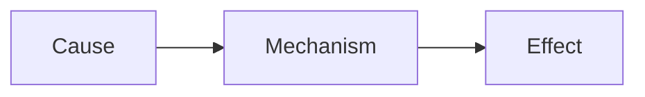

# <COURSE> L<NN>: <Lecture Title>

**Date:** <YYYY-MM-DD> · **Professor:** <name> · **Unit/Exam:** <e.g., Midterm 1>
**Sources:** Slides `<file>` [S#] · Recording/transcript `<file>` [mm:ss] · Reading `<ref>` [R: …]
**Big question:** <One sentence: what problem does this lecture answer?>

**Learning objectives** (from syllabus/slides, or inferred `[Added]`)
- By the end, I can <verb> …
- …

---

## Warm-up (attempt before reading; it's fine to guess)
1. <pretest question>
2. …

Answers

1. … (see §1)
2. …

---

## 1. <Section title> [S1–S6]

- Main point in own words. [S2]
  - Supporting detail. [04:12]
  - Supporting detail.
- **<Key term>**: precise definition. *In plain words:* … *Example:* … [S3]

> **Key idea:** <most important claim in this section>

> **Exam signal [07:45]:** "<quote or paraphrase of professor's emphasis>"

<!-- Diagram if relevant -->

*What it shows:* … *Why it matters:* …

**Check yourself** *(answer aloud before opening)*
1. <why/how question>
   

Answer

   … [S4][05:30]
   

2. <recall question>
   

Answer

   …
   

---

## 2. <Section title> [S7–S15]

<!-- For quantitative content -->
$$ <formula> $$

| Symbol | Meaning | Units |
|---|---|---|
| | | |

*Use when:* … *Assumptions:* …

**Worked example: <one-line problem>** [S12][22:10]
*Given:* … *Find:* …
1. **Identify the approach.** Because …, use …
2. **Set up.** …
3. **Solve.** …
4. **Check.** Units / sign / magnitude / limiting case.
**Answer:** …
**Pattern to remember:** When you see <cue>, do <method>.

**Check yourself**
1. …

---

## Comparison matrix
| | <Item A> | <Item B> | <Item C> |
|---|---|---|---|
| <Attribute 1> | | | |
| <Attribute 2> | | | |
| **How to tell apart** | | | |

## Connections
- Builds on: <L0X §Y: how>
- Leads to: <next topic / later lecture>
- Big-picture theme: <how this fits the course's core ideas>
- Reading link: <R: … extends/contradicts …>

## Common mistakes and confusions
- **<Mistake>**: why it's wrong → correct idea. (Source: student Q at [31:20] / professor warning [S14])

## Summary
<5–8 sentence prose paragraph that connects the lecture's ideas and answers the Big question. Written as an argument, not a list.>

## Explain it back (answer in your own words; no answers provided on purpose)
1. Explain <core concept> to a friend who hasn't taken this class, without using <jargon term>.
2. Why does <X> lead to <Y>? What would happen if <condition changed>?
3. <Create/evaluate prompt: e.g., "Design a quick experiment to test …">

## Gaps and [VERIFY]
- [ ] <Unclear point → question for office hours / textbook check>

## What your notes missed
<!-- Include only if the student's own notes were provided -->
| Missed or incorrect point | Why it matters | Source |
|---|---|---|
| <point absent from or wrong in your notes> | <exam signal / connects X and Y> | [S#][mm:ss] |

**Revision task:** add each point to *your own* notes in your own words, and link it to something already there (an arrow, "because…", "unlike…"). Revising, not recopying, is what improves learning.

---
**Next steps (Cornell cycle)**
- [ ] **Today, recite:** cover each section, answer its "Check yourself" questions **aloud in your own words**, then open the answers. Then do "Explain it back".
- [ ] **<date +1d>, quiz:** `quizzes/Q-L<NN>.md`, closed-book, rating confidence before checking.
- [ ] **Weekly, review:** 10 min reciting cue questions across all notes. Next full review: <date +7d>.
- [ ] <N> new flashcards added to the deck. Import `deck.tsv` into Anki.
