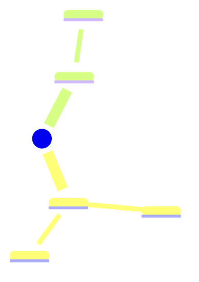

# <COURSE> <Exam Name> Study Guide

**Exam:** <date, time, room> · **Format:** <n MCQ, n SA, n problems/essays> · **Allowed:** <…> · **Scope:** <lectures, readings>
**Priorities from exam intelligence:** <what past exams and professor emphasis tell us>

## 1. Big picture

<3–5 sentences: the story that connects the unit.>

## 2. Priority map
| Priority | Topic | Why (weight, signals, my mastery) | Notes |
|---|---|---|---|
| High | | | L0X |
| Medium | | | |
| Low | | | |

## 3. Topic-by-topic
### <Topic A> (L0X, L0Y), priority: High
**You must be able to:**
- Explain why …
- Calculate …
- Compare … with …

**Key terms:** term: short definition · …
**Key formulas:** $…$ (use when …)
**Representative problem:** <one problem + short solution or pointer to worked example>
**Traps:** <common mistakes>

### <Topic B> …

## 4. Master comparison matrices
| | | | |
|---|---|---|---|

## 5. Formula / fact sheet
<condensed; if a cheat sheet is allowed, format to the allowed size (e.g., 1 page, both sides)>

## 6. Problem-type catalogue (quantitative courses)
| When you see… | Do this first | Example |
|---|---|---|

## 7. Mixed self-test (interleaved)
1. … → see L03 §2

Answer

…

## 8. Exam-day plan
- Brain dump on scratch paper: <formulas, frameworks>
- Time budget: <minutes per section>
- Strategy reminders from my last exam wrapper: <…>
